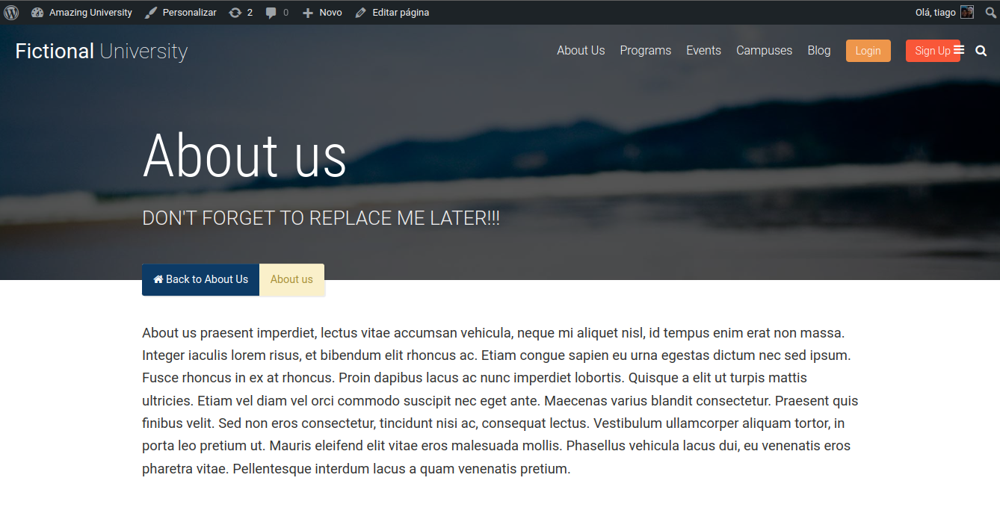
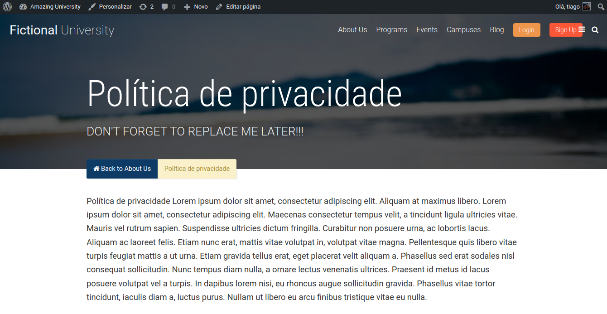
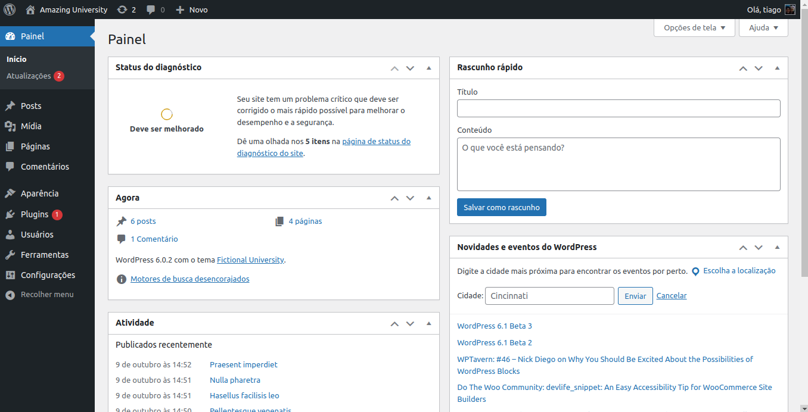
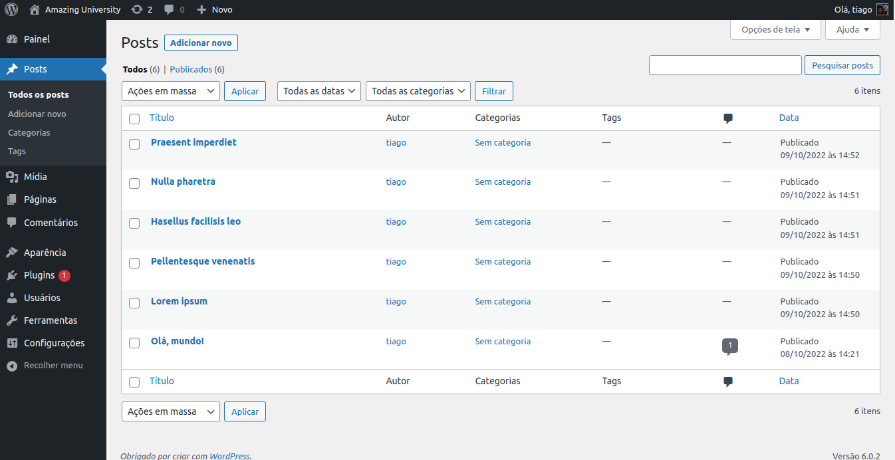
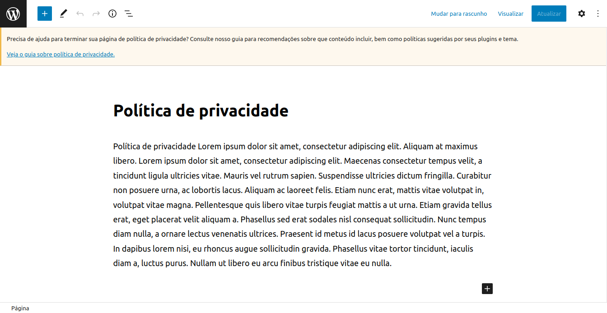

<p align="center">
  <a href="https://skillicons.dev">
    
  </a>
</p>

# Fictional University

Follow these steps to set up the Fictional University project on your local environment.

## Installation Instructions

1. **Download or Clone the Project**

   - Download, fork, or clone the project repository to your local machine.

2. **Change Project Name**

   - Rename the project directory to `fictional_university` or any other desired name.

3. **Update .htaccess File**

   - Modify the following lines in the `.htaccess` file:
     ```
     RewriteBase /fictional_university/
     RewriteRule . /fictional_university/index.php [L]
     ```

4. **Create Database**

   - Create a MySQL database named `fictional_university` or any preferred name.

5. **Run SQL Scripts**

   - Execute the SQL code in either `wp.sql` or `fictional_university.sql` to populate the database.

6. **Update wp-config.php**

   - Update the following lines in the `wp-config.php` file:
     ```
     define('WP_HOME', 'http://localhost/fictional_university');
     define('WP_SITEURL', 'http://localhost/fictional_university');
     ```

7. **Save Permalinks**

   - Go to `wp-admin/options-permalink.php` and save permalinks to avoid potential Wordpress bugs.

## About the Project

This Wordpress website was created as part of learning exercises from Udemy classes. It serves as a beginner's guide to building a Wordpress site.

Feedback and suggestions are welcome!

### Screenshots

#### Website





#### Admin Panel



